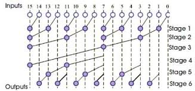

# Parallel-Prefix-Adders
A repository of 16-bit high-performance Parallel Prefix Adders described in Verilog HDL.

---

## Description
This project provides Verilog implementations of various 16-bit parallel-prefix adders. These adders are known for their high performance and are commonly used in digital design for arithmetic operations. The repository includes the source code for the adders, along with a testbench for verification and block diagrams for visualization.

---

## Adders Implemented
The following parallel-prefix adders are included in this repository:

---

- Brent-Kung

- Han-Carlson

- Knowles

- Kogge-Stone

- Ladner-Fischer

- Sklansky

---

## Getting Started
To use these adders, you will need a Verilog simulator. The included testbench.v file can be used to test the functionality of each adder.
The testbench generates *N* ammounts of random test cases, feel fee to change it to your desires.

---

## Contact

For questions or feedback, feel free to reach out:

- **Email**: d2022004055@unifei.edu.br
- **GitHub**: [JASLemos](https://github.com/JASLemos)

---
